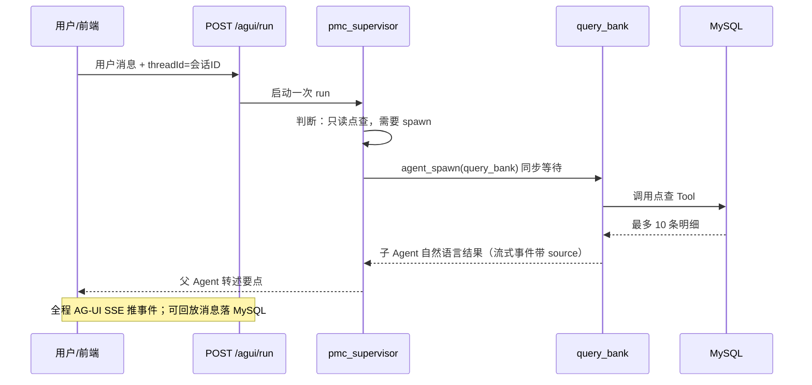
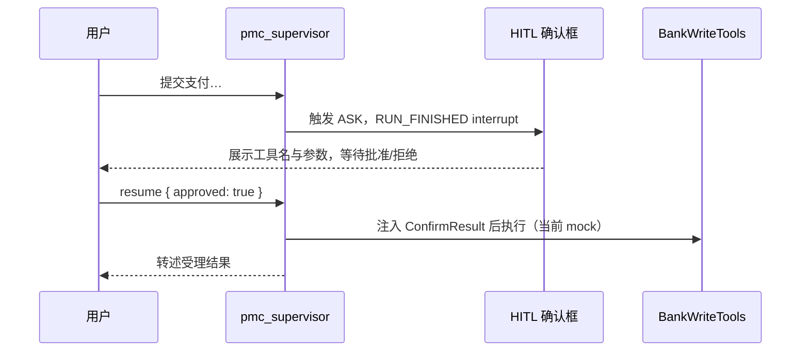
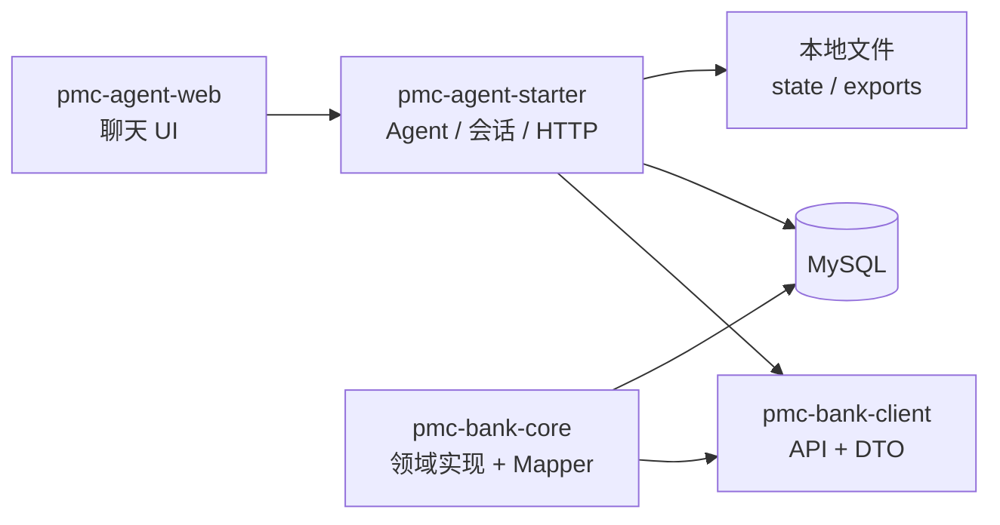
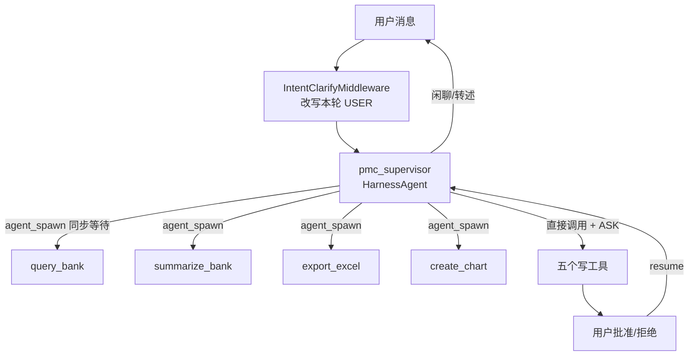

# 1 当前系统功能

本文把 pmc-agent 当成一个「医院财务同事能用的银企助手」来讲：它能做什么、不能做什么、一句话发出去之后后台怎么走。阅读对象是刚入门的同学；遇到专业词会先给定义，再落到本仓库的类名与接口。

**核心结论先摆出来：**

pmc-agent 不是「一个会聊天的 SQL 窗口」。它是一套可中断的多 Agent 系统：

- 父 Agent（`pmc_supervisor`）负责听懂用户、调度子 Agent、执行写操作；进 ReAct 前由意图澄清中间件改写本轮用户消息；
- 四个只读子 Agent 分别做点查、汇总、导出、图表；
- 写操作必须人工确认（HITL）后才执行；
- 前后端用 AG-UI 协议流式通信，历史消息按同一套协议落库回放；
- 点踩把整次会话写入 Langfuse Dataset；模型调用与 Prompt 版本可在 Langfuse 对照。

查询走真实 MySQL；写操作目前仍是 mock，但确认链路是真的。

---

## 1.1 先搞清几个基础概念

如果你是第一次做 Agent，建议先把下面六个词对齐。后文会反复用到。

### 1.1.1 LLM（大语言模型）

LLM 是「根据上文预测下文」的模型。它擅长：理解自然语言、规划步骤、组织答复。它不擅长：保证数字真实、保证一定调用了数据库、保证不会编造。

所以资金类系统里有一条铁律：**金额、笔数、账号等事实只能来自系统查询，不能来自模型「感觉」。**

### 1.1.2 Tool（工具）

Tool 是一段**确定性的程序代码**，例如「按账号查余额」「按条件导出 Excel」。模型不直接写 SQL；它只能通过 Function Calling 提出「我想调用哪个工具、参数是什么」，由运行时真正执行，再把结果（observation）喂回模型。

可以把它想成：模型是调度员，Tool 是只能按说明书操作的柜员机。

### 1.1.3 Agent（智能体）

Agent = 模型 + 工具 + 循环。常见循环叫 **ReAct**：

1. Thought：模型思考下一步；
2. Action：调用工具或结束；
3. Observation：拿到工具结果；
4. 再 Thought……直到给出最终答复或达到最大轮数。

和普通 Chat 的差别：Chat 主要是补全文本；Agent 可以在中途改世界状态（查库、写文件、发起支付）。

### 1.1.4 Multi-Agent（多 Agent）

一个 Agent 挂太多互相冲突的工具时，模型容易用错工具。例如：点查最多返回 10 条，汇总却要全表 `SUM`。若挂在同一个 Agent 上，模型常会用 10 条样本回答「一共多少」。

多 Agent 的本质不是「人多力量大」，而是**把互相冲突的成功标准拆开**：点查 Agent 只准点查，汇总 Agent 只准聚合。

### 1.1.5 HITL（Human-in-the-Loop，人在回路）

写操作（提交支付、从银行拉数）有资金或外部副作用，不能让模型直接执行。HITL 的意思是：Agent 跑到危险步骤时**暂停**，等用户批准或拒绝，再继续。

本系统里，暂停表现为 AG-UI 的 `RUN_FINISHED.outcome = interrupt`；用户点批准后，同一接口再发一次带 `resume` 的请求。

### 1.1.6 流式（Streaming）

用户不想等整段答完才看到字。服务端把模型输出和工具过程切成事件，用 SSE（Server-Sent Events）推给前端，前端边收边渲染。这叫流式。

本系统的流不是自研 JSON，而是 **AG-UI** 标准事件（文本增量、工具调用、思考过程、中断等）。

---

## 1.2 产品定位：银企直连助手做什么

业务背景：医院财务要通过银行查账户、看流水、下支付、下回单。传统做法是登录网银或在多个页面跳转。pmc-agent 的目标是：

> 财务人员用自然语言提问，系统自动选对能力、查真实数据、必要时弹出确认框。

| 用户可能说的话 | 系统应走的能力 | 不应做什么 |
|---|---|---|
| 「你好，你能干什么？」 | 父 Agent 自己闲聊说明 | 编造账户余额 |
| 「查一下账号 6222… 最近流水」 | 子 Agent `query_bank` 点查 | 用 10 条样本说「一共多少」 |
| 「这个月支付合计多少」 | 子 Agent `summarize_bank` SQL 聚合 | 先点查再心算 |
| 「导出上月交易明细」 | 子 Agent `export_excel` | 把表格单元格塞进模型上下文 |
| 「画个按日支出折线图」 | 子 Agent `create_chart` | 用点查样本画假图 |
| 「提交一笔支付 / 同步回单」 | 父 Agent 调写工具 + HITL | 未经确认直接执行 |

默认租户 `T001`。点查上限 **10 条**是产品约束：明细只能当「看看样例」，不能当全量统计。

用户说「有多少钱 / 合计」时，澄清层应改写成汇总任务并交给 `summarize_bank`，而不是让点查 Agent 用 10 条样本心算。多轮「那这个账号呢」依赖 MySQL 会话历史补槽位，不依赖前端把全文历史每次都带上。

---

## 1.3 一句话发出去之后发生了什么

用「查某账号最近流水」举例，主链路如下。



若用户说「提交支付」，链路会在写工具处停住：



读这两张图时记住三件事：

1. **对外只有一个 Agent 入口**：`pmc_supervisor`。用户不直接点选子 Agent。
2. **只读走 spawn，写操作挂父 Agent**：原因见第 02 篇；这里先记结论。
3. **前端看到的卡片**，来自协议事件里的 `source` / `CUSTOM subagent.*`，不是模型在文本里写了「我是查询助手」。

---

## 1.4 模块怎么拆，为什么这样拆

Maven 三个模块**同进程启动**，不是三个微服务。前端 `pmc-agent-web` 是独立 Vite 工程。



| 模块 | 职责 | 入门理解 |
|---|---|---|
| `pmc-bank-client` | 银企对外接口与 DTO | 「菜单说明书」，没有查库实现 |
| `pmc-bank-core` | 充血实体、仓储、AppService | 「真正上菜的厨房」 |
| `pmc-agent-starter` | HarnessAgent、Tool 封装、会话、AG-UI | 「服务员 + 调度台」 |
| `pmc-agent-web` | 会话列表、流式渲染、确认框 | 「前台窗口」 |

为什么 Agent 不能直接引用 Mapper？因为对话编排变得很快，银企单据规则相对稳。编译期只让 Agent 依赖 `client`，可以避免「Prompt 一改，SQL 层被顺手改乱」。这是**模块边界**，不是为了拆微服务。

技术版本（以当前代码为准）：Java 21、Spring Boot 3.5.x、AgentScope 2.x、MyBatis-Plus、MapStruct、FastExcel、前端 `@ag-ui/client`。

---

## 1.5 Agent 拓扑（现网权威）

配置入口：`HarnessAgentConfig`。父 Agent 用 `@AguiAgentId("pmc_supervisor")` 注册。



意图澄清 Agent **不**作为用户可聊入口，也不出现在 `agent_spawn` 名单里。HITL 的 approved/denied 跳过澄清。细节见 [04](./04-增量会话问题与方案.md) 4.8。

### 1.5.1 父 Agent 的三条硬规则

写在 `SUPERVISOR_PROMPT` 里，不是口头约定：

1. **问候、闲聊自己说**，不编造业务数据；看到 `【已澄清任务】` / `【意图澄清】` 块按块执行，不要再 spawn `intent_clarify`。
2. **只读业务必须 `agent_spawn`**，且 `timeout_seconds` 必须等于配置（默认 120），同步等待；否则用户看不到子 Agent 流式过程。
3. **写操作由父直接调写工具**，调用前用一句话说明；点查不要调写工具。一次只 spawn 一个；有依赖则串行（先汇总再出图）。

### 1.5.2 为什么 Toolkit 关闭并行

父、子 Toolkit 都是 `parallel(false)`。并行能降延迟，但会放大：工具参数互相依赖时的错序、一次确认多个副作用、流式事件交错。银企场景正确性优先于并发吞吐。

### 1.5.3 为什么关掉 filesystem / shell 等通用能力

Harness 默认可能带文件、Shell、记忆压缩等通用工具。本项目业务是银企单据，打开这些工具等于给模型「越权通道」。配置里显式 disable，只保留业务 Tool 与调度所需的 spawn 能力。

### 1.5.4 用户看不到的调度工具

Harness 内置调度工具（如 `agent_spawn`、`agent_list`、`task_output` 等）会对用户隐藏。前端过滤后，用户看到的是「总助手」气泡和四类业务卡片，而不是编排协议细节。

---

## 1.6 业务工具清单

### 1.6.1 点查 `BankQueryTools`（挂在 `query_bank`）

`queryAccounts`、`queryBankPayOrders`、`queryBankPayOrderDetails`、`queryTradeDetails`、`queryElectronicReceipts`、`queryBalanceFlows`、`queryElectronicStatements`。

特点：返回条数有硬上限（默认 10）。结果应带「是否截断」语义，避免模型把样本当成全量。

### 1.6.2 汇总 `BankAggregateTools`（挂在 `summarize_bank`）

对交易、支付单、账户、回单、对账单等做 SQL `GROUP BY` / `SUM` / `COUNT`。按账号、日、月、方向、对手、状态等分组。

特点：数字来自数据库聚合，不是模型估算。

### 1.6.3 导出 `ExcelExportTools`（挂在 `export_excel`）

服务端流式写 Excel，返回 `fileId` / `downloadUrl` / 行数。模型只转述「已生成文件，点此下载」，**不把单元格内容塞进上下文**。

下载：`GET /files/{fileId}`。文件在磁盘（默认 `./data/exports`），**索引在内存**——进程重启后链接可能失效。

### 1.6.4 图表 `ChartTools`（挂在 `create_chart`）

基于汇总结果生成 ECharts option JSON，前端图表组件渲染。禁止用点查样本「手搓」假数据点。

### 1.6.5 写工具 `BankWriteTools`（挂在父 Agent）

| 工具名 | 含义 |
|---|---|
| `submitBankPayOrder` | 提交支付单 |
| `syncTradeDetails` | 从银行同步交易明细 |
| `syncBalanceFlows` | 同步余额流水 |
| `syncElectronicReceipts` | 同步电子回单 |
| `syncElectronicStatements` | 同步电子对账单 |

实现是 mock：`mocked=true`，生成假受理号，不写业务表、不调真实银行。HITL 接线是真的：未批准不会执行。

---

## 1.7 银企领域模型（为什么要七张表）

医院银企场景里，一张「流水表」不够。支付有主单与明细，交易有回单与对账单，余额有变动流水。本系统七个实体互相用单号对齐，才能做「单据穿透」：业务支付单 → 银行明细 → 电子回单。

| 实体 | 表 | 入门理解 |
|---|---|---|
| Account | `bank_account` | 医院在银行开的户 |
| BankPayOrder | `bank_pay_order` | 一笔对外支付主单 |
| BankPayOrderDetail | `bank_pay_order_detail` | 主单下的收款明细 |
| TradeDetail | `trade_detail` | 银行侧交易明细 |
| ElectronicReceipt | `electronic_receipt` | 电子回单 |
| ElectronicStatement | `electronic_statement` | 电子对账单 |
| BalanceFlow | `balance_flow` | 余额变动流水 |

默认租户 `T001`。种子数据由集成测试灌入**真实 MySQL**（约 10 账户、十万级支付及相关单据）。因此：查询/汇总/导出是真查库；只有写操作仍是 mock。

充血模型的意思：实体不只是字段袋子，还带业务行为与不变式（状态是否允许流转等）。入门阶段你只要记住：**领域规则放在 core，不放在 Prompt 里「求模型自觉」。**

---

## 1.8 会话、HTTP 与 AG-UI 协议

### 1.8.1 对外 HTTP

| 接口 | 作用 |
|---|---|
| `GET/POST/PATCH/DELETE /sessions` | 会话列表、创建、改标题、软删 |
| `GET /sessions/{id}/messages` | 历史消息，原样返回 AG-UI `Message[]` |
| `POST /agui/run` | 流式对话与 HITL resume |
| `GET /files/{fileId}` | 下载导出文件 |

已废弃：旧的 `/stream`、`/resume_stream`。

关键约定：

- `threadId` = 数字会话 id（创建会话后拿到）；
- 请求头带用户身份（如 `X-User-Id`）进入运行时上下文；
- Vite 开发时把 `/agui`、`/sessions`、`/files` 代理到后端 `8080`。

### 1.8.2 AG-UI 是什么

AG-UI（文档里也常写 AG-UI / AGUI）是一套**前后端约定好的事件与消息模型**。你可以把它理解成「Agent 版的前端状态协议」：

- 文本怎么开始、增量、结束；
- 工具调用怎么开始、传参、返回；
- 思考过程怎么展示；
- 跑完是成功、失败，还是中断等用户确认。

本系统用到的标准事件包括：`RUN_STARTED` / `RUN_FINISHED` / `RUN_ERROR`、`TEXT_MESSAGE_*`、`REASONING_MESSAGE_*`、`TOOL_CALL_*` 等。自定义进度例如 `intent_clarify.start` / `intent_clarify.end` **必须出现在 `RUN_STARTED` 之后**，否则官方客户端会报 `First event must be 'RUN_STARTED'`。

子 Agent 过程通过 `CUSTOM` 扩展，例如：

- `subagent.text` / `subagent.thinking`
- `subagent.tool_call` / `subagent.tool_result`
- `subagent.lifecycle`

写操作确认走官方 HITL：`RUN_FINISHED` 的 outcome 为 interrupt，metadata 带工具信息。前端批准后再次 `POST /agui/run`，例如：

```json
{
  "resume": [
    {
      "interruptId": "...",
      "status": "resolved",
      "payload": { "approved": true }
    }
  ]
}
```

payload 必须是 `{ approved: boolean }`，不要传 JSON `null`（前端 schema 校验会失败）。

### 1.8.3 持久化为什么要分三层

入门最容易混淆的是：把「聊天记录」「Agent 内部状态」「待确认动作」当成同一张表。

| 层 | 存什么 | 存在哪 | 丢了会怎样 |
|---|---|---|---|
| 业务会话 | 标题、是否 interrupted | MySQL `chat_session` | 侧栏会话乱 |
| 可回放消息 | 协议 Message JSON | MySQL `chat_message` | 刷新后对话空白/不一致 |
| Agent 续跑状态 | Harness 内部 state | MySQL DistributedStore（库 `agentscope`） | 多实例/重启后续跑能力受影响 |
| HITL pending | 待确认工具调用 | 进程内存 | 重启后批准会找不到 |
| 导出索引 | fileId → 路径 | 内存；文件在磁盘 | 重启后下载失败 |

`server-side-memory: false` 的含义：AG-UI 服务端不另维护一份对话 memory；可见历史由本仓库 MySQL + 前端 `HttpAgent.messages` 负责。

落库由 enricher（如 `AguiPersistEnricher`）在消息结束、工具结束、run 结束等时机写入。**思考过程也要落库**，否则实时能展开思考，切会话后就没了。带 `resume` 的用户消息不重复落库。

---

## 1.9 前端行为（用户看见什么）

交互形态对标常见大模型聊天页：左栏会话、主区消息、底部输入。本地通常只持久化 `userId`。

渲染真相是 AG-UI `Message`，常见角色：

- `user`：用户
- `assistant`：助手（可带 `toolCalls`）
- `tool`：工具结果
- `reasoning`：思考过程
- `activity`：活动（本系统用 `TOOL_CONFIRM` 表示待确认）

`groupMessagesForRender` 一类逻辑会把连续同一子 Agent 的消息收进嵌套卡片。时间线对用户是：

1. 用户提问；
2. 可能先出现「正在进行意图澄清…」（不占用子 Agent 卡片）；
3. 总助手开始处理；
4. 出现「查询/汇总/导出/图表」嵌套卡片，卡片内有工具过程与子回复；
5. 总助手用自然语言转述要点；用户可对助手回复点踩，写入 Langfuse `base-case`。

会话 UI 状态大致：`idle` / `streaming` / `awaiting_confirm` / `error`。待确认时输入框禁用，只能批准或拒绝。

---

## 1.10 HITL 写权限（现网方案 A）

权限配置直觉：

- 父 Agent 默认 `BYPASS`（只读调度与转述不打断）；
- 五个写工具名显式 `ASK`；
- 子 Agent 全部 `BYPASS`（它们只有只读工具）。

链路：

1. 父 Agent 决定调用写工具；
2. 权限系统发出需要确认的事件；
3. `AguiPermissionHitlEnricher`（或同类）登记 AG-UI `Interrupt`，并把 pending 放入内存 store；
4. 流以 interrupt 结束，会话状态变 interrupted；
5. 用户批准/拒绝后，resume middleware 注入 `ConfirmResult`；
6. 批准则执行 mock 写逻辑并转述；拒绝则不执行。

Interrupt TTL 通常按小时级配置（如 24 小时）。pending 在内存：单机演示可用，生产要换 Redis/DB（见第 02、03 篇）。

---

## 1.11 明确还没做完的事

读功能文档时同样要知道边界，避免把「演示已通」当成「生产已完备」。

- 写操作未接真实银行，也不落业务表。
- HITL pending 与导出索引在内存，重启丢失；Agent 内部 state 已进 MySQL DistributedStore。
- 意图澄清依赖 Langfuse Prompt 与 `generate_response` 路径一致；远端稿与代码 fallback 可能漂移。
- 前端个别文案可能仍残留旧产品品牌，与银企定位不完全一致。
- 没有旧 Graph 时代的 checkpoint 表；旧 `/stream` 契约已删除。

---

## 1.12 本章小结

1. 系统目标：用对话完成银企点查、汇总、导出、图表，并对写操作做人工确认。
2. 架构形态：同进程多模块 + 父 HarnessAgent + 四个只读子 Agent + 父挂写工具。
3. 事实来源：只读查 MySQL；模型只负责理解与转述。
4. 协议：AG-UI 同时服务实时流与历史回放。
5. 状态分层：会话消息、Agent state、HITL pending 不要混成一张表。
6. 观测与评测：模型 generation 与 Prompt 版本在 Langfuse；点踩写入 Dataset。

下一篇会解释：为什么不是「一个 Agent 挂所有工具」、为什么从 Spring AI Alibaba 迁到 AgentScope、为什么写工具不能塞进子 Agent。09-12 之后的增量见第 04 篇。
