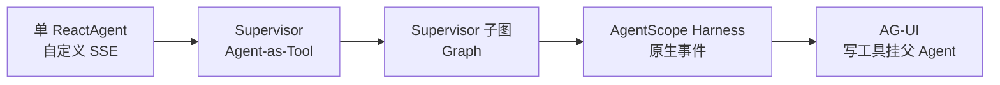

# 2 开发问题、方案与取舍

第 01 篇讲「现在是什么」。这篇讲「怎么变成现在这样」。面向入门读者：每个坑都会先说**现象**，再讲**根因**，再讲**试过什么**，最后讲**为什么留下这一版**。

**全文主线一句话：**

多数复杂度不是 Prompt 没写好，而是**编排模型选错了**。Agent-as-Tool 把子 Agent 变成同步黑盒；Graph 子图又把路由协议泄漏到 UI，并在共享 state 上踩坑。最终用 Harness 的 `agent_spawn` 解决子 Agent 流式，用 AG-UI 统一前后端消息，用「写工具挂父 Agent」绕开子 Agent 权限无法冒泡的限制。

时间线大约在 2026-09-11 至 09-12，分支 `feat/spring-ai-alibaba-init`。更早会话在本机 transcript 中不完整，以本仓库可核对材料为准。

---

## 2.1 入门：什么叫「编排模型」

做 Agent 时，除了「会不会调工具」，还要决定：

- 一个 Agent 还是多个 Agent？
- 多个 Agent 时，谁调用谁？同步还是流式？
- 用户能不能看见子 Agent 的中间过程？
- 危险操作在哪一层暂停？

这些选择合称**编排（orchestration）**。编排选错，后面会用大量补丁假装正确；编排选对，Prompt 只负责业务话术，不必扛架构责任。

本项目编排演进可以画成：

| 阶段 | 做法 | 一句话评价 |
|---|---|---|
| 起步 | 单 Agent + `/stream` | 能聊能调工具，撑不住汇总/导出分工 |
| 多 Agent v1 | 子 Agent 当 Tool 同步调用 | 实现快，子过程不可见，Tool 观测不能在前端流式输出 |
| 多 Agent v2 | Graph Supervisor 子图 | 子过程可见，但路由 JSON 与 state 很脆 |
| 现网 | Harness spawn + AG-UI | 子过程可见且保序；写 HITL 走主 Agent |

---

## 2.2 起步阶段：版本、脚手架、HITL 雏形

### 2.2.1 问题：要不要上 boot-framework / Boot 4 / 很高的 JDK

**现象：** 引入公司公共包后出现 `NoClassDefFoundError`（Jackson 相关类找不到）。

**根因（入门版）：**  
同一项目里混进了两套 Jackson 世代。公共包的 JSON 工具走新坐标，Spring Boot 3.5.x 生态仍大量依赖旧注解包。类名看起来都叫 Jackson，运行时却对不上。升到 Boot 4 后又撞上模型自动配置在新 Spring 下 bean 名失败。

**选项：**

1. 强行钉依赖版本；
2. 升 Boot / JDK 追齐公共包；
3. 不用公共 JSON 工具，回到官方示例能跑的版本组合。

**选定：** Boot 3.5.x + JDK 21，不用那套 JsonUtils，不依赖会拉裂 Jackson 的 boot-framework。

**为什么：** Agent 项目的关键路径是模型、流式、工具与协议。公共基类的收益填不平版本裂口。入门教训：**先保证主链路可运行，再谈统一工具类。**

### 2.2.2 问题：接口做成普通 Chat，还是做成可中断 Agent

**现象：** 很多人第一版只暴露 `POST /chat`，返回一整段文本。

**为什么不够：** 银企很快会出现「提交支付要确认」。若主契约是普通 chat，后面要补：中断、恢复、tool 反馈、会话线程。补丁会散落各处。

**选定：** 一开始就做「可中断 Agent」：请求带 `threadId`，resume 带工具反馈，缺省批准策略明确。对齐官方 Studio 的 stream/resume 形态，但不拷贝整套 Studio 加载器。

**入门类比：** 普通 chat 像一次性电话；可中断 Agent 像「通话中可以按保持键，对方确认后再继续」。资金场景需要后者。

### 2.2.3 问题：会话存在哪

**否决：**

- 只用浏览器 localStorage 当消息源（换电脑/清缓存就没了，也无法服务端审计）；
- 复用库里旧 Graph checkpoint 表当聊天记录（那是运行时检查点，不是给用户看的对话）。

**选定：** 业务库新建会话表与消息表。Graph 时代另有 checkpoint 表，与业务表分离。后来去掉额外 `chat_id`，对外直接用自增 `sessionId` 当线程 id，重启后多轮与 resume 才能接上。

**入门要点：** 「用户可见对话」和「框架内部 checkpoint」是两件事，表不要混用。

---

## 2.3 流式乱序：字怎么会缠在一起

### 2.3.1 现象

前端和数据库里出现错乱拼接，例如问候语和账户问句缠在一起。第一反应常是：「是不是多 Agent 并行把字弄乱了？」

### 2.3.2 两个必须先分清的概念

1. **增量 chunk vs 快照 chunk**  
   增量的意思是：每次只下发「新多出来的几个字」。下游必须按顺序追加。若顺序乱了，字会交错。快照则是每次下发「到目前为止的全文」，乱序时至少还能用版本号取最新。

2. **线程池名字会骗人**  
   Spring MVC 把响应式流转成 SSE 时，发送线程常叫 `task-*`。这是 Web 层发射线程，**不是** Graph 并行节点池。Graph 并行池通常是另一套名字。把 `task-*` 当成「图在并行」会误判根因。

### 2.3.3 根因

- 模型流是增量；
- Reactor 里用不保序的 `flatMap` 并发发射；
- 再叠上 MVC SSE 发送线程与模型客户端的调度线程。

三组线程一起工作时，chunk 更容易乱。

### 2.3.4 修法与教训

按序发射（例如 `concatMap` / 单线程 `publishOn`）；社区 issue 里也有保序讨论。  

**对后续选型的影响：** 选框架时，「事件是否带 source、是否保序」变成硬指标，而不只看谁能调 Tool。

---

## 2.4 为什么银企 Tool 要拆成四个只读 Agent

### 2.4.1 产品矛盾

先做了多个点查 Tool，返回上限 10 条。用户立刻会问：

- 「一共多少？」
- 「按月统计」
- 「导出」
- 「画图」

若仍用点查工具：

- 模型可能拿 10 条样本「估算」全量 → **幻觉**；
- 或者把十万行塞进上下文 → **贵、慢、仍可能摘要错误**。

把 `maxRows` 调大不能从根上解决：点查与全量统计的成功标准互相冲突。

### 2.4.2 选定：按成功标准拆 Agent

| Agent | 解决什么 | 禁止什么 |
|---|---|---|
| `query_bank` | 单号/账号/最近几笔 | 合计、趋势 |
| `summarize_bank` | SQL 聚合 | 用明细样本推全量 |
| `export_excel` | 流式写盘，只回下载信息 | 把单元格灌进 LLM |
| `create_chart` | 聚合结果变图表 option | 用点查结果画假图 |

Excel 选流式写入方案（FastExcel 一类），因为导出是写文件场景，不需要完整 POI 对象模型。建议上限约 2 万行。

### 2.4.3 为什么不另开一套查询 REST

业务入口已经是对话。再开 HTTP 查询，容易让权限、租户、分页规则在「对话工具」和「REST」两套入口分叉。本项目选择：**只给 Agent 注册 Tool**，领域能力仍落在 bank-core，通过 API 复用。

### 2.4.4 为什么实体要从内存 record 改成真库

汇总 SQL、导出、大数据量验证都必须在库侧完成。内存 mock 无法证明 `GROUP BY` 与十万级数据是否正确。于是改为充血实体 + MySQL，并用种子任务灌数。

**入门结论：** 防幻觉不能只靠 Prompt 写「不要编造」；要用工具边界让「编造」变得更难。

---

## 2.5 多 Agent 第一轮：Agent-as-Tool

### 2.5.1 当时为什么选它

Spring AI Alibaba 当时官方推荐 Supervisor（Agent-as-Tool）：父 Agent 把子 Agent 当成一个大 Tool 来调用。旧的 Flow + JSON 数组路由 Supervisor 已标记过时。项目按官方推荐走。

### 2.5.2 收益

实现快。父 Agent 视角很简单：调用 `query_bank` 工具 → 拿回字符串结果。

### 2.5.3 代价（入门版逐条）

1. **同步黑盒**  
   父线程调用 `invoke()`，等到子 Agent 整段跑完才返回。子 Agent 中间的 token、内部 tool 过程，默认不会出现在父级 SSE 里。用户看到的是「卡住很久，突然出一个结果」。

2. **子 HITL 冒泡不上来**  
   子 Agent 若自己做人工确认，确认发生在子调用栈内部；父的 resume 接口接不到。于是「写操作子 Agent + 统一 resume」在这条路上基本走不通。

3. **终答位置错乱**  
   子终答常被塞进 Tool 的 response 字段。前端若只渲染助手文本，会出现「内容在工具块里，外面没有助手气泡」。

4. **过滤事件后丢终答**  
   若只处理流式增量、过滤了 finished 类事件，没有增量的终答会被丢掉。

5. **历史解析互递归**  
   会话历史解析函数互相调用，打开会话可能栈溢出。这是工程细节，但说明旁路数据结构已经复杂到危险。

### 2.5.4 当时的补丁为什么最终扔掉

做过旁路追踪：在同步调用外包一层，把子内部 tool 事件「偷」出来推给前端。演示能过，但维护的是**两套流模型**：框架真流 + 自己伪造的流。官网对嵌套实时流的正路是子图/带 source 的事件流，不是把 `invoke()` 拆开。

**入门判据：** 只要产品要求「看见子 Agent 过程」，就不要选同步 Agent-as-Tool 当长期方案。

---

## 2.6 多 Agent 第二轮：Supervisor 子图

### 2.6.1 为什么改

用户明确反馈：现实现太复杂。查社区后锁定「子图编排」，接受 deprecated 的 Supervisor subAgents API，并把相关依赖钉到带该类的里程碑版本。旁路追踪代码删除。

子图的直觉：父图里有路由节点，真正干活的是子 Agent 节点；事件可以从图执行过程冒出来。

### 2.6.2 新规则带来的新坑

路由节点（main）被要求**只输出 JSON 数组或 FINISH**，例如 `["query_bank"]`。合法路由包含闲聊、点查、汇总、导出、图表、结束。

#### 坑 A：问候失败、前端空白

用户说「你好」。main 把自然语言当 JSON 解析，失败后直接 FINISH；同时某些 SSE 路径还吞了增量。用户看到空白。

**修法：** 增加 `general_chat` 子能力；强制 main 只输出 JSON；闲聊也不再由 main「随口说」，而是路由到闲聊能力。

**入门教训：** 控制面协议（路由 JSON）和用户可见文本混在同一通道时，一句「你好」就能让系统按故障路径走。

#### 坑 B：循环停不下来

闲聊答完后，main 下一轮又路由到闲聊。有人想写 Hook「闲聊后强制 FINISH」。用户否决写死 Hook。

**真正根因：** 子 Agent 配置了独立 `outputKey`，终答写到单独字段，不进共享 `messages`。main 下一轮看不见「已经答过了」，于是再派一次。

**修法：** 去掉独立 outputKey；Prompt 要求「已有子 Agent 自然语言答复必须 FINISH」。

**入门教训：** Graph 共享 state 的 key 设计是控制流的一部分。state 看不见结果，就会死循环。用 Hook 掩盖，会留下「Prompt 与代码双重真相」。

### 2.6.3 这一轮仍然没解决的结构问题

即便问候与死循环修了，仍有：

- flatMap 乱序风险；
- main 的 JSON 泄漏到 UI；
- 子图终答有时只在 state 里，需要额外恢复；
- 子图 agent 标识为空时只能靠 node 名回退。

这些说明：Graph Supervisor 能用，但对「面向用户的嵌套对话产品」不够友好。再加 Hook 只会继续堆复杂度。

---

## 2.7 迁到 AgentScope：能对上痛点，但不是插件替换

### 2.7.1 调研结论（入门版）

AgentScope Java 的 Harness 模式提供：

- 父 Agent + 子 Agent 声明 + `agent_spawn`；
- `streamEvents()`，子事件带 `source`，保序；
- 权限系统：需要确认的事件、确认结果、权限模式；
- 模型仍可走 DashScope。

它**不能**当 Spring AI Alibaba Graph 的 drop-in：checkpoint、注解、SSE 形态都要换。

### 2.7.2 迁移时刻意保留的产品心智

隐藏 `agent_spawn` 等调度工具，父闲聊在展示层映射成总助手，是为了让用户仍看到「总助手 + 业务卡片」，而不是看到编排协议。

工程上先做 spike 测试：证明子 Agent 流式可观测，再迁业务 Tool。这是正确顺序——先验证架构假设，再搬业务。

---

## 2.8 流式协议：原生事件还是 AG-UI

### 2.8.1 两种选择分别是什么

| 方案 | 含义 | 好处 | 代价 |
|---|---|---|---|
| 原生 AgentEvent | 后端直接推框架事件 | 子事件已有 source，嵌套 UI 少一层翻译；HITL 也可直接吃确认事件 | 前端绑定单一运行时 |
| AG-UI | 推跨语言标准事件 | 历史与实时共用 Message 模型；易接社区前端 | 子事件常打成 CUSTOM；HITL 要适配 interrupt/resume |

### 2.8.2 决策过程

助手更推荐原生事件（更贴嵌套卡片）。用户要求**按 AG-UI 完全重构**。项目按用户决策落地。

### 2.8.3 选定后真实付出的成本

- 删除旧 `/stream`、`/resume_stream`；
- 入口改为 `POST /agui/run`；
- 子 Agent 变为 `CUSTOM subagent.*`；
- HITL 改为 `RUN_FINISHED.interrupt` + `resume[]`；
- 否决继续手写一套「渲染专用 ChatMessage」；历史 API 改为返回协议 `Message[]`；
- 旧消息表结构作废重建，不做旧数据兼容。

### 2.8.4 一个很能说明问题的小 bug

切会话后思考过程没了：实时流有 reasoning 事件，后端没落库。修法是 persist enricher 持久化 reasoning。

**入门结论：** 协议对齐不只是事件名一致，还要**历史回放与实时流同构**。前端能播的，数据库就要能还原。

---

## 2.9 写操作 HITL：为什么最终不做 `write_bank` 子 Agent

### 2.9.1 需求

提交支付、同步流水/回单/对账单必须人工确认。

### 2.9.2 SAA 时期就判死刑的路径

子 Agent 被同步当成 Tool 调用时，内部 HITL 到不了父级 resume。当时曾计划「HITL 挂在父对 write_bank 这一次调用上」，但编排路线随后被推翻，计划未完整落地。

### 2.9.3 AgentScope 上「做了写子 Agent 却没有确认框」

官方机制可以概括成三条，缺一就会表现为「工具直接跑了」或「前端看不到确认」：

1. **默认权限 + 空规则太容易变成 BYPASS**  
   子 Agent 被 spawn 时，若权限被认为「无关紧要」，可能被合并成旁路放行。写工具必须显式 ASK 规则。

2. **AG-UI 的官方 HITL 是主 Agent 的 interrupt**  
   不是只靠自定义 `subagent.require_confirm` 事件。本地 spawn 的确认事件**默认不会**自动变成父 interrupt。

3. **文档里的远程传播策略不等于本地自动冒泡**  
   不能指望「我开了 DEFAULT，本地子 Agent 确认就会出现在父 run 上」。

### 2.9.4 方案 A / B 对比

| 方案 | 做法 | 结果 |
|---|---|---|
| B | 保留 `write_bank`，显式 ASK，关闭继承，Enricher 把子确认冒泡成父 interrupt | 能做，但要对抗默认行为，适配层更重 |
| A | 写工具挂父 Agent；父 BYPASS + 五工具 ASK；删除写子 Agent | **现网** |

**选定 A 的理由（入门版）：**  
只读子 Agent 的产品价值是「嵌套过程可见」；写操作的产品价值是「可靠暂停」。AG-UI HITL 的一等公民是**当前 run 的主 Agent**。把写工具放在父上，确认框、resume、确认结果都走官方主路径，不必长期维护「子确认 → 父 interrupt」适配层。

**代价：** 父 Prompt 必须写清「写操作不要 spawn」；点查与提交在模型侧可能混淆，要靠工具描述和 ASK 规则压住。

写执行体仍 mock：先把确认链路做真，再接银行。这是刻意的交付切片。

---

## 2.10 模块拆分与前端嵌套卡片

### 2.10.1 后端为何拆 client/core/starter

当 Tool 与领域模型变多，单模块里 Agent 直接碰 Mapper，会把「对话编排」和「银企单据」焊死。拆模块后：

- client：稳定 API；
- core：查库与领域规则；
- starter：Agent 与 HTTP。

同进程启动，不是微服务。收益是**编译期边界**。

### 2.10.2 前端为何要嵌套卡片

若子 Agent 终答与父终答都平铺成 assistant 气泡，用户会感觉两个人在抢麦，对话不连贯。

修法演进：

- SAA 时期靠特殊 node 标记 + agentName；
- AgentScope / AG-UI 后靠 `source` 与 `CUSTOM subagent.*`；
- 渲染层把同一子 Agent 的 tool 与回复收进一张卡片。

这是产品决策：用户要看到「总助手请来查询同学干活」，不是一条平坦 token 流。

---

## 2.11 仍存在的工程债（诚实清单）

- 写路径 mock；HITL store 与导出索引在内存。
- Agent 状态文件化，多实例/容器滚动会丢内部 state。
- 配置文件不宜存放模型密钥，应走环境变量。
- 前端品牌文案可能未完全切到银企。
- 从 SAA 迁走后，旧 Graph 检查点与旧消息表不迁移：协议都换了，兼容成本高于清库。

---

## 2.12 可以复用的选型原则

1. **子 Agent 要不要被用户看见过程**，决定能不能用 Agent-as-Tool。要嵌套流式，就不要选同步 `invoke()`。
2. **控制面协议不要出现在用户消息通道**。让模型输出 `["query_bank"]` 当路由，终究会被「你好」炸开。
3. **HITL 挂在真正能打断当前 run 的那一层**。挂在看不见的子调用里，resume 接不上。
4. **明细、汇总、导出、图表必须分工具分 Agent**。上限 10 条是防样本冒充全量，不是性能调参。
5. **流式协议与落库 schema 必须同构**。前端能播的事件，历史接口也要能回放。

下一篇把这些机制收成面试问答：先补知识点，再给出可对质的答法。
