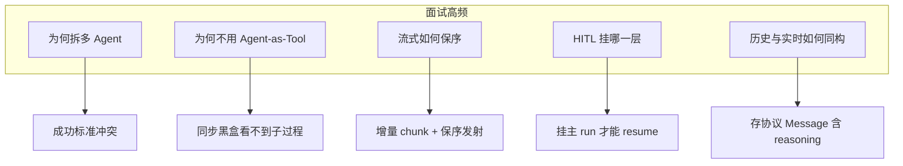

# 3 国内 Agent 开发面试题与解答

面向国内 Java / 智能体应用岗位。写法按「入门也能看懂」组织：

1. 每节先给**知识点铺垫**（小白版）；
2. 再给**面试题与参考答**；
3. 答法尽量落到 pmc-agent 的真实机制，方便你对照代码复习。

候选人若只会说「我们用了 ReAct 和 Tool」，通常过不了二面。面试官要听的是：你是否理解边界、失败模式与取舍。

---

## 3.1 基础：Agent 到底是什么

### 知识点铺垫

- **Chat**：把用户话和历史发给模型，拿回一段文本。
- **Tool**：一段程序。模型通过 Function Calling 提出调用，运行时执行后把结果喂回模型。
- **Agent**：模型在循环里反复「思考 → 调用工具 → 观察结果」，直到能回答或达到轮次上限。
- **ReAct**：上述循环的一种常见叫法（Reason + Act）。
- **幻觉**：模型把听起来像真的内容当成事实。资金场景里，幻觉 = 事故。

### 题 1：把 LLM 包一层 HTTP 叫 Agent 吗？你们系统里最小闭环是什么？

**答：** 不算。Chat 是补全；Agent 至少要有决策、工具执行、观察回写、停止条件，以及失败/中断路径。

本系统最小闭环：

1. 用户发消息进入 `pmc_supervisor`；
2. 模型决定 `agent_spawn` 某只读子 Agent，或调用写工具，或直接闲聊；
3. 工具/子 Agent 返回观察；
4. 模型转述；
5. 达到 `maxIters` 或 HITL 中断则结束。

问候走父 Agent 直出，不编造业务数据。`query_bank` 是 Agent；`queryAccounts` 是 Tool。

### 题 2：Function Calling 和「让模型输出 JSON」有何不同？

**答：** Function Calling 有三件事：schema 校验、运行时执行器、把结果作为 observation 回灌。普通 JSON 模式只约束文本长得像 JSON，没有执行、没有权限、没有中断。

反例：曾用模型输出 JSON 数组做**路由协议**，用户说「你好」不是合法 JSON，路由直接失败。控制面协议不适合赌自由文本。

### 题 3：为什么 Toolkit 要关闭并行？

**答：** ReAct 循环里并行工具能降延迟，但会放大：

- 参数互相依赖时的错序；
- 一次确认多个副作用；
- 流式事件交错难读。

银企写操作和「先汇总再出图」是串行语义，父/子 Toolkit 都 `parallel(false)`。这是正确性优先。

---

## 3.2 多 Agent：什么时候拆，怎么拆

### 知识点铺垫

单 Agent 挂所有工具，像让一个人同时当柜员、会计、出纳、报表员。模型会串岗：用点查的 10 条样本回答「一共多少」。

拆多 Agent 的判据不是「业务对象多」，而是**成功标准是否冲突**：

- 点查：少而准；
- 汇总：全表聚合；
- 导出：大结果不进上下文；
- 图表：要 option 不是散文。

常见 Supervisor 三种实现：

| 模式 | 机制 | 适合 | 不适合 |
|---|---|---|---|
| Agent-as-Tool | 父把子当同步 Tool | 不展示子过程、无嵌套 HITL | 嵌套流式、子内部确认 |
| Graph 子图 | 共享 state 路由 | 固定工作流 | 路由 JSON 泄漏；state key 差会死循环 |
| Harness spawn | `agent_spawn`，事件带 source | 让用户看见子过程 | 子 HITL 默认不冒泡 |

### 题 4：什么时候该上多 Agent？

**答：** 当工具成功标准冲突时。本系统四个只读子 Agent + 父挂写工具，就是按这个拆的。不要为了「看起来高级」硬拆。

### 题 5：Agent-as-Tool 为什么看不到子 Agent 内部过程？

**答：** 父只拿到 `invoke()` 返回值。子循环发生在调用栈内部，父级 SSE 没有子 token 和中间 tool 事件。旁路追踪能演示，但维护两套流模型，成本会指数上升。要嵌套实时流，应走子图或带 source 的事件流。

### 题 6：Graph 里独立 outputKey 会导致什么？

**答：** 子结果写到父看不见的字段，父下一轮以为没答过，再次路由，表现为死循环。修法是让终答进入共享消息，并用明确 FINISH。不要再用「闲聊后强制结束」的硬编码 Hook 掩盖——那会造成 Prompt 与代码双重真相。

### 题 7：`agent_spawn` 为什么要设 timeout 且同步等待？

**答：** 异步 fire-and-forget 时，用户看不到子过程，父也可能抢跑。本系统把超时写进父 Prompt，并与配置一致（如 120 秒）。这是产品约束（看见过程）对调度语义的要求。

---

## 3.3 流式、保序与协议

### 知识点铺垫

- **SSE**：服务端持续推事件的 HTTP 用法，适合打字机效果。
- **增量 chunk**：每次只给新字；乱序拼接必花字。
- **AG-UI**：跨语言 Agent UI 协议，统一文本/工具/思考/中断等事件，并定义 Message 角色，便于实时与历史同构。

### 题 8：SSE 字序错乱如何定位？

**答：**

1. 先确认 chunk 是增量还是快照；
2. 查是否用不保序 `flatMap`；
3. 查 MVC 把 Flux 转 SSE 的发送线程（常是 `task-*`）；
4. 查模型客户端是否丢到别的调度池。

不要先猜「Graph 并行」。本项目里 `task-*` 是 SSE 发送路径，Graph 并行池是另一组名字。修法：保序算子或单线程 publish；落库在消息结束时写完整对象。

### 题 9：为什么换 AG-UI？和原生事件比差在哪？

**答：** AG-UI 把前端状态机标准化，`HttpAgent.messages` 可同时服务实时流和历史回放。

代价：子事件常变成 `CUSTOM subagent.*`，嵌套 UI 要二次映射；HITL 要从确认事件适配成 `RUN_FINISHED.interrupt` + `resume`。

口诀：要跟社区前端/标准组件，选 AG-UI；只绑定单一运行时且嵌套卡片最省事，原生事件更短。本项目按产品要求选了前者。

### 题 10：历史消息存渲染 DTO 还是协议 Message？

**答：** 存协议 Message。渲染 DTO 会让回放与实时 `defaultApplyEvents` 分叉。本系统一行一条 `role` + JSON；思考过程也要存，否则刷新后 reasoning 消失。

### 题 11：`server-side-memory: false` 是什么意思？

**答：** AG-UI 服务端不另维护对话 memory。可见历史在 MySQL 消息表 + 前端 messages；Agent 内部续跑状态在文件 state store。面试时要能区分：**聊天记录 ≠ Agent state ≠ checkpoint**。

---

## 3.4 HITL 与权限

### 知识点铺垫

- **只读操作**：查余额、汇总——一般不需要确认。
- **写操作**：提交支付、向银行拉数——需要确认。
- **ASK / BYPASS**：ASK 表示调用前要问人；BYPASS 表示放行。
- **interrupt / resume**：跑到中途暂停；用户决定后带着 interruptId 继续。

关键坑：确认挂错层。挂在父看不见的子调用里，前端 resume 接不上，表现为「工具直接跑了」或「点了批准没反应」。

### 题 12：什么操作必须 HITL？点查要不要确认？

**答：** 有资金或外部副作用的必须确认。点查、汇总默认不确认。导出若含敏感数据可做下载鉴权，但不一定阻塞 Agent 循环。确认粒度按**工具名**配 ASK，不要对整个子 Agent 一刀切。

### 题 13：为什么子 Agent 的确认弹不出来？

**答（按排查顺序）：**

1. 是否 DEFAULT + 空规则，被当成 trivial，spawn 时变成 BYPASS；
2. 前端是否只听了自定义 confirm 事件，而官方结束态是 interrupt；
3. 本地 spawn 确认是否默认变成父 interrupt（通常不会）；
4. resume payload 是否 `{ approved: boolean }`，有没有传 JSON null。

本项目最终把写工具挂父 Agent，让 ASK 发生在主 run。这是框架语义下的最短路径，不是「父更聪明」。

### 题 14：HITL pending 放内存可以吗？

**答：** 单机演示可以。重启、多实例会丢 pending，批准时找不到 interruptId。生产应把 pending（threadId、工具参数、过期时间）放 Redis/DB，并与会话 `interrupted` 一致。面试要主动承认内存方案是债。

### 题 15：拒绝确认后，模型应看到什么？

**答：** 明确的拒绝确认结果，而不是超时或空结果。否则模型会重试、再打断，或编造「已提交」。Middleware 负责把 resume 翻译成运行时确认块。

---

## 3.5 工具、数据与幻觉

### 知识点铺垫

防幻觉有三层，强度递增：

1. Prompt 约束（最弱）；
2. 工具返回带 `truncated=true` 等元数据；
3. **拆工具/拆 Agent**，让「用错数据回答」变困难（最强）。

导出十万行时，正确做法是服务端写文件，只把下载信息回给模型。

### 题 16：如何防止模型用 10 条明细回答全量合计？

**答：** 不要只靠 Prompt。点查硬上限；汇总走 SQL；导出自己查库；图表吃聚合。评测用「一共多少」看是否调用 summarize 而不是 query。

### 题 17：十万行导出怎么做？

**答：** Tool 流式写 Excel，返回 fileId/url/行数。模型只转述下载信息。把二维表塞进上下文又贵又容易诱发错误摘要。

### 题 18：Tool 返回结构怎么设计？

**答：** 短、有业务键、有是否截断。写工具返回 `mocked=true` 和受理号，避免模型说「已从银行成功扣款」。错误用稳定错误码，不要堆栈全文进上下文。

### 题 19：租户权限放 Prompt 里够吗？

**答：** 不够。默认租户可写在 Prompt/默认参数，真正过滤必须在 SQL。模型可以撒谎；数据库不能。HITL 也不能替代租户隔离。

---

## 3.6 工程与架构

### 知识点铺垫

- **模块边界**：编译期不让 Agent 引用 Mapper，逼所有访问走 API。
- **同进程多模块 ≠ 微服务**：部署简单，边界仍清晰。
- **框架选型**：先列硬约束（嵌套流式、HITL、多 Agent、状态存储），再选框架，而不是追新。

### 题 20：为什么拆 bank-client / bank-core / agent-starter？

**答：** 对话编排迭代快，单据规则相对稳。client 是契约，core 查库，starter 编排。同进程降低分布式成本，编译期禁止 Agent 碰 Mapper。

### 题 21：Spring AI Alibaba 和 AgentScope 怎么选？

**答：** 看硬需求。要嵌套子 Agent 流式、事件带 source、权限 ASK，AgentScope Harness 更直接。已深度绑定 Graph 且工作流固定、不展示子过程，SAA 仍可用。本项目迁走，是因为子流式与路由协议在 Graph Supervisor 上是结构性问题；社区保序 issue 只能兜底，不能提供 source 级嵌套事件。

### 题 22：状态存在 JSON 文件有什么问题？

**答：** 单机方便；容器滚动、多副本、只读文件系统会坏。生产评估 DB/Redis 的 state store。聊天记录已在 MySQL，不要和内部 state 混表，但要用同一 sessionId 关联。

### 题 23：如何评测 Agent？

**答：** 至少四类，而不是「像不像人」：

1. 路由：问候不调工具；余额走 query；合计走 summarize；导出走 excel；趋势走 chart；提交走写工具且中断；
2. 反幻觉：无工具结果不得编造金额；
3. HITL：未批准不执行；拒绝后不说已成功；
4. 回放：刷新后卡片/思考/确认框与实时一致。

承认端到端仍偏手工也可以，但要有用例意识。

---

## 3.7 前端与协议协作

### 知识点铺垫

协议是前后端共同契约。前端自己拼一套「看起来对」的气泡，历史回放又走另一套，是最常见翻车点。

### 题 24：为什么要用嵌套卡片？

**答：** 平坦列表里父终答和子终答都是 assistant，用户分不清谁在说话、工具属于哪一步。卡片把一次 spawn 收束成：用户 → 总助手调度 → 业务卡片 → 总助手转述。这需要协议带 source/name，文本前缀不可靠。

### 题 25：前端该自己拼 token 还是信任 messages 回调？

**答：** 标准角色走官方 applyEvents / onMessagesChanged，保证与历史一致。只有扩展 CUSTOM 才自己拼，并尽量映射回标准 Message。两套拼装并存时，HITL 和思考折叠最容易只在实时路径生效。

---

## 3.8 现场短问答

**maxIters 设多少？**  
无普适数字。子 Agent 约 8 次够「选工具→调用→总结」；父约 12 次覆盖「spawn + 转述 + 必要时再 spawn」。过大有成本与死循环风险；过小会在多步任务中途停死。

**模型怎么选？**  
调度需要强指令遵循；子 Agent 填参也需要遵循。路由乱跳时先升遵循性更强的模型，而不是先堆 Hook。

**日志打什么？**  
threadId、agent source、toolName、是否 interrupt、token usage。不要打全量单据。

**安全红线？**  
密钥走环境变量；写操作默拒；租户 SQL 强制；隐藏 shell/filesystem；导出链接要鉴权；Prompt 注入不能改写「写工具无需确认」。

---

## 3.9 面试官评分口径

| 档位 | 表现 |
|---|---|
| 合格 | 能画父/子/工具/HITL；知道点查与汇总为何拆开；能解释 interrupt/resume |
| 良好 | 能讲清 Agent-as-Tool 黑盒、outputKey 死循环、chunk 乱序线程模型；能说明写工具为何挂父 Agent |
| 优秀 | 把协议、落库、前端状态机当成同一契约；能主动列出内存 pending、文件 state、mock 写路径的生产改造；能设计路由评测集而不是只谈调 Prompt |

---

## 3.10 用一张图复习全场高频点

复习建议：对着第 01 篇把链路走一遍，再对着第 02 篇用「现象→根因→取舍」讲给别人听。能讲顺，面试就稳了一大半。
