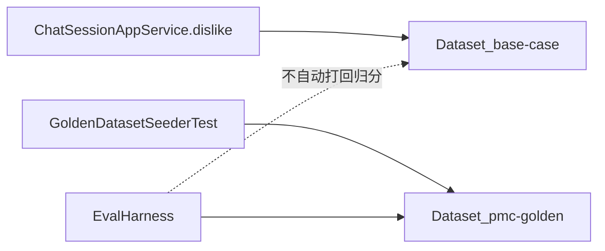
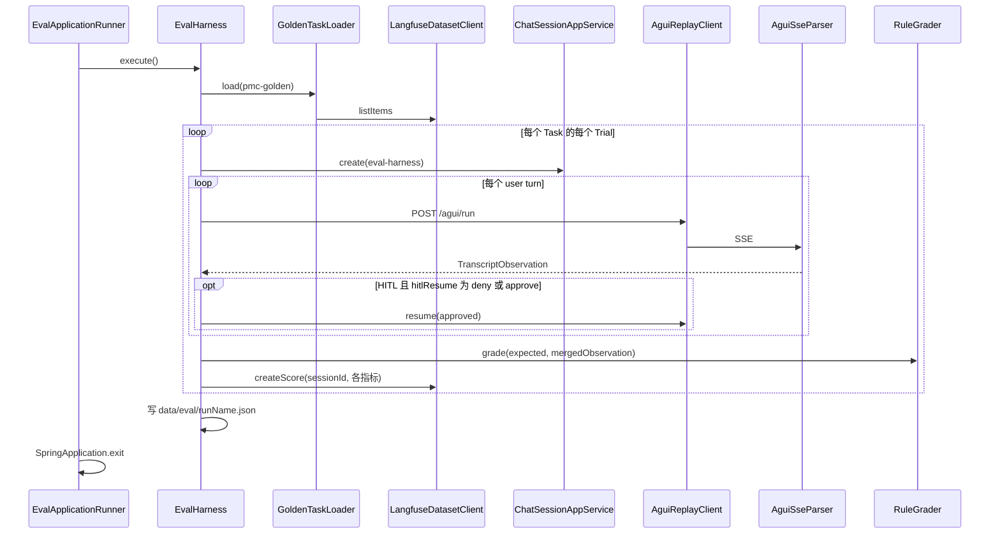

# 05 Agent 回测：流程、指标与实现

本文对应仓库当前代码（`pmc-agent-starter` 的 `io.github.navms.agent.eval`），说明 pmc-agent 如何对现网同一入口做回归回测。读者需要先有 01 里的编排心智：父 Agent `pmc_supervisor` 通过 `agent_spawn` 交给只读子 Agent，写工具走 HITL。04 第 4.14 节是设计摘要，细节以本文为准。

**核心结论：** 回测不是把点踩会话当标准答案重放。标准答案只存在于 Golden Set 的 `successCriteria`。Harness 为每条 Task 开独立会话，对现网 `POST /agui/run` 发用户轮次，从 SSE 抽出「spawn 了谁、调了什么写工具、有没有 interrupt / 澄清」，再用规则 Grader 打分。分数写到 Langfuse Session，汇总 JSON 落本地。点踩 Dataset 只负责回流失败样本，不自动进回归分母。

## 1 回测要解决什么问题

pmc-agent 的失败形态很少是「答案数字错一位」。更常见的是：

- 该 spawn `summarize_bank` 却走了 `query_bank`
- 缺账号时没澄清，直接编造或乱查
- 支付 / 同步没走到 HITL
- 闲聊却拉起了业务子 Agent

这些问题用「对比最终回复文本」很难稳定判定。模型措辞会变，业务数字依赖种子库，HITL 默认拒绝后也不会真正落支付。因此回测把成功标准钉在**可观察的控制面行为**上，而不是钉在最终自然语言。

不能把 thumbs-down 轨迹当 ground truth。点踩样本经常本身就是错路由；原样重放只能复现失败，不能定义成功。进入回归必须经过人工钉标准，落到 `pmc-golden`。

## 2 概念模型

对照测评文档的五个名词，本仓库的落点如下。


| 概念            | 本仓库对象                                      | 含义                                                      |
| ------------- | ------------------------------------------ | ------------------------------------------------------- |
| Task          | `GoldenTask`                               | 一条带稳定 id 的评测题，对应 Langfuse Dataset item id               |
| Trial         | `EvalHarness.runTrial` 的一次循环               | 同一 Task 的一次独立执行；可配置 `trials` 次                          |
| 1. Transcript | AG-UI SSE + `TranscriptObservation`        | 本轮实际发生了什么                                               |
| Grader        | `RuleGrader`                               | 对照 `successCriteria` 打分，不调用 LLM                         |
| Outcome       | `GradeResult.outcomeStatus` + `EvalResult` | `SUCCESS` / `FAILED` / `HARNESS_SKIP` / `HARNESS_ERROR` |


Task 只描述「用户说了什么」和「必须 / 禁止发生什么」。它不锁工具调用顺序，也不锁回复模板。

## 3 两套 Dataset，两条写入链路

Langfuse 上有两套 Dataset，schema 故意不同。



### 3.1 base-case：点踩回流

用户对某条助手消息点踩后，`ChatSessionAppService#dislike` 把**整段会话**写成 Dataset item。

- item id：`pmc-thumbsdown-{sessionId}-{messageId}`，用于幂等 upsert
- input：强类型 `io.github.navms.agent.observability.dataset.Input`（`title`、`sessionId`、`messages`）
- metadata：`Metadata`（`userId`、`dislikedMessageId`、`rating=down`）
- 通常没有 `expectedOutput`

`messages` 是 AG-UI 协议消息，含 reasoning、toolCalls、tokenUsage。这是失败现场，不是标准答案。

读取时用 `DatasetItems.inputOf` / `metadataOf`，与写入同一套 record，避免一边拼 Map、一边按 JsonNode 猜字段。

### 3.2 pmc-golden：可回归的 Golden Set

仓库内权威题面是 `pmc-agent-starter/src/main/resources/eval/golden/golden-tasks.json`。当前约 16 条，覆盖闲聊、点查、汇总（含「有多少钱」禁点查）、导出、图表、缺槽澄清、多轮补槽、支付/同步 HITL。

item 的 input 是 `GoldenInput`：`title` + `turns`（评测只发送 `role=user` 的轮次）。`expectedOutput` 含 `taskType`、`weight`、`layer`、`successCriteria`。

写入 Langfuse **不走 Harness**。`GoldenDatasetSeederTest#seedClasspathGolden` 读 classpath JSON，调用 `LangfuseDatasetClient#upsertGoldenItem`。跑 seed：

```bash
mvn -pl pmc-agent-starter test -Dtest=GoldenDatasetSeederTest
```

该测试会启动 Spring 上下文（`pmc.eval.enabled=false`，避免评测 Runner 把进程退出），并对真实 Langfuse 做 upsert。

### 3.3 读取时如何区分两种 item

`GoldenTask.fromDatasetItem` 的分支在 `DatasetItems.goldenItem`：

1. 若 `expectedOutput.successCriteria` 非空 → 按 Golden 解析（`turns` + `ExpectedOutput`）
2. 否则若 input 能转成 `GoldenInput` 且 `turns` 非空 → 仍按 Golden
3. 否则按 base-case：从 `Input.messages` 抽出 user 文本作为 `GoldenTask.turns`

Harness 主流程只 `GoldenTaskLoader.load(dataset)`，默认 dataset 名 `pmc-golden`。无 `turns` 或无 `successCriteria` 的 item 会被 skip，不进入分母。

## 4 模块与调用链

评测代码集中在 `io.github.navms.agent.eval`，不侵入业务 Domain。它依赖现网的 `ChatSessionAppService` 建会话、依赖 AG-UI HTTP、依赖 `LangfuseDatasetClient` 写分。




启动条件：`pmc.eval.enabled=true` 时注册 `EvalApplicationRunner`。默认配置里该开关为 `false`，避免普通启动误跑评测并 `System.exit`。

```bash
mvn -pl pmc-agent-starter spring-boot:run -Dspring-boot.run.arguments=--pmc.eval.enabled=true
```

相关配置（`pmc.eval` / 环境变量）：


| 配置               | 默认                            | 作用                                          |
| ---------------- | ----------------------------- | ------------------------------------------- |
| `enabled`        | false                         | 是否启动后跑批退出                                   |
| `dataset`        | pmc-golden                    | Langfuse Dataset 名                          |
| `runName`        | 空则 `pmc-eval-yyyyMMdd-HHmmss` | 本地报告文件名与 score metadata                     |
| `maxItems`       | 0                             | 截断题量，0 表示全部                                 |
| `timeoutSeconds` | 180                           | 单次 AG-UI HTTP 超时                            |
| `trials`         | 1                             | Task 未单独指定 trials 时的重复次数                    |
| `hitlResume`     | approve                       | `deny` / `approve` 会 resume；`none` 不 resume |
| `outputDir`      | ./data/eval                   | 汇总 JSON 目录                                  |
| `userId`         | eval-harness                  | 评测会话用户                                      |


进程退出码：Harness 在 **高权重 Task 失败** 时返回 1；`execute()` 捕获之外的异常由 Runner 返回 2。当前实现对 `HARNESS_ERROR` 会计入 summary，但 **不一定把退出码设为 2**（见第 9 节）。

## 5 一次 Trial 怎么跑

`EvalHarness.runTrial` 把「隔离」做成新建 `chat_session`，而不是复用点踩会话 id。这样内存里的 HITL pending、导出索引、子 Agent 生命周期都不会串题。

### 5.1 建会话

`CreateSessionCommand(eval-harness)` → `chat_session` 主键即 AG-UI 的 `threadId`。创建失败直接记 `HARNESS_ERROR`，不进入规则评分。

### 5.2 逐轮 POST /agui/run

`AguiReplayClient.sendUser` 构造与前端同类的 body：

- `threadId` = sessionId 字符串
- `runId` = 新 UUID
- `messages` = 仅本轮一条 user（id 新生成，content 来自 `GoldenTurn`）
- Header：`X-User-Id`、`X-Agent-Id=pmc_supervisor`、`Accept=text/event-stream`

多轮 Task（例如 `multiturn-slot-fill`）是**同一 session 连续发多条 user**，不是把历史 messages 一次性塞进第一次 run。服务端从业务库读历史，这与现网多轮一致。

非 user 或空 content 的 turn 会被跳过。

### 5.3 HITL resume

若本轮观察 `interrupted()==true` 且配置为 `deny` 或 `approve`，Harness 再 POST 一次，body 带 `resume`：

```json
[{ "interruptId": "<RUN_FINISHED.interrupts[].id>", "status": "resolved", "payload": { "approved": true或false } }]
```

`approved` 仅当 `hitlResume=approve` 为 true。写操作 Task 的成功标准通常是「出现 interrupt」，不是「支付成功」。默认拒绝更符合「断言中断」；当前 `application.yml` 默认是 `approve`，跑回归前要按题意确认。

`hitlResume=none` 时不 resume。对必须 HITL 的题，只要第一轮已经 `interrupted=true`，规则仍可通过；resume 主要用于把会话从 pending 收尾，避免残留状态。

某一轮 `observation.failed()`（HTTP 非 2xx、超时、`RUN_ERROR`）会中断后续 turn。

### 5.4 合并观察

多轮 / resume 会产生多份 `TranscriptObservation`。`TranscriptObservation.merge`：

- `subAgents` / `writeTools` 做集合并
- `interrupted`、`clarified` 做或
- 助手正文换行拼接
- 保留**第一次** harnessError
- interruptIds 取最后一次带 id 的 interrupt 列表
- `latencyMs` 用 Trial 墙钟，覆盖各段 SSE 里的 0

合并后再交给 `RuleGrader`。因此多轮题看的是整段会话的控制面，而不是只看最后一轮。

## 6 从 SSE 抽出观察：AguiSseParser

Grader 不读 Langfuse Trace，也不解析 chat 表。它只相信这一轮 HTTP 响应里的 AG-UI 事件。解析器按 SSE 空行分帧，用 JSON 的 `type`（或 SSE `event:`）分发。

### 6.1 关注的事件


| 事件                                      | 抽出的事实                                          |
| --------------------------------------- | ---------------------------------------------- |
| `TOOL_CALL_START`                       | 工具名；若是写工具或业务 Agent 名则入对应集合                     |
| `TOOL_CALL_ARGS` / `TOOL_CALL_DELTA`    | 按 toolCallId 拼接参数                              |
| `TOOL_CALL_END`                         | 若工具是 `agent_spawn`，从参数 JSON 读子 Agent 名         |
| `CUSTOM` `subagent.lifecycle`           | `value.source` 末段若是业务 Agent 则计入 spawn          |
| `CUSTOM` `subagent.tool_call`           | 子 Agent 侧工具名（写工具也会被记）                          |
| `CUSTOM` `intent_clarify.start` / `end` | `clarified=true`                               |
| `TEXT_MESSAGE_CONTENT`                  | 拼接 `assistantText`（只作记录，不参与规则）                 |
| `RUN_FINISHED`                          | `outcome=interrupt` 或 `interrupts[].id` → HITL |
| `RUN_ERROR`                             | `harnessError`                                 |


`agent_spawn` 参数里的 Agent 名会尝试字段 `name` / `agent` / `subagent` / `agent_name` / `agentName`。JSON 解析失败时，退化为在原始参数字符串里 `contains` 四个业务 Agent 名。这是为了对付流式 args 截断，误报风险是字符串碰巧包含账号里的子串；业务 Agent 名足够特殊，实际冲突很少。

### 6.2 目录：什么算「实际工具」

`EvalCatalog` 写死两份白名单：

- 业务子 Agent：`query_bank`、`summarize_bank`、`export_excel`、`create_chart`
- 父 Agent 写工具：`submitBankPayOrder`、`syncTradeDetails`、`syncBalanceFlows`、`syncElectronicReceipts`、`syncElectronicStatements`

`actualTools()` = 上述两个集合的并。闲聊、`agent_list`、读文件等 **不算** 进 precision/recall 分母。这是刻意的：评测关心路由对不对，不关心 Harness 内部工具。

未出现在白名单里的 spawn，观察层直接丢弃。因此如果未来加了第五个业务 Agent，必须同时改 Catalog、Golden 标准和 Parser，否则回测会「看起来全绿」。

## 7 成功标准：只钉不可省略的动作

`SuccessCriterion` 三条字段：`id`（失败分类主键）、`kind`、`value`。

`RuleGrader.gradeOne` 按 kind：


| kind                   | 判定                                 | 失败 category                                           |
| ---------------------- | ---------------------------------- | ----------------------------------------------------- |
| `required_agent`       | `subAgents` 包含 value               | `tool_missing`                                        |
| `forbidden_agent`      | `subAgents` 不包含 value              | `wrong_agent`                                         |
| `required_write_tool`  | `writeTools` 包含 value              | `tool_missing`                                        |
| `forbidden_write_tool` | `writeTools` 不包含 value             | `wrong_tool`                                          |
| `interrupt`            | `interrupted` 等于布尔 value           | 应为 true 时 `hitl_skipped`；应为 false 时 `hitl_unexpected` |
| `required_clarify`     | `clarified==true`（value 在实现里未参与比较） | `clarify_miss`                                        |
| `clarify_only`         | 本 Trial 无任何业务 spawn 且无写工具          | `clarify_miss`                                        |
| 其它                     | 直接失败                               | `invalid_criterion`                                   |


**全部 criterion 都通过**，`task_complete=1`，否则为 0。这是硬门槛，没有部分分。

`errorCategory` 取**第一条失败**的 category，不是合并所有失败。读报告时要看 `EvalResult` 里的分项 `CriterionResult`，不能只看一个标签。

`rootCauseLayer`：规则失败记 `AGENT`；SSE/HTTP/建会话失败记 `HARNESS`。环境（模型额度）目前没有单独分层，超时会落在 Harness。

未知 kind 会让整题 `task_complete=0`。改 schema 时旧 item 会集中失败，这是可接受的告警，而不是静默忽略。

## 8 指标如何计算

分两层：Trial 内指标（`RuleGrader` + `e2e_latency_ms`），Run 级汇总（`EvalHarness.execute` 末尾）。

### 8.1 Trial 指标

记 `required` = 所有 `required_agent` 与 `required_write_tool` 的 value 集合（保持插入顺序的 `LinkedHashSet`）。`actual` = `observation.actualTools()`。


| 指标                      | 公式                               | 边界                                  |
| ----------------------- | -------------------------------- | ----------------------------------- |
| `task_complete`         | 全部 criterion 通过则为 1，否则 0         | Harness 失败时为 0                      |
| `tool_precision`        | |actual ∩ required| / |actual|   | actual 空：required 也空则为 1，否则 0       |
| `tool_recall`           | |required ∩ actual| / |required| | required 空则为 1（闲聊题）                 |
| `tool_set_match`        | actual 与 required 集合相等则为 1       | 顺序无关，多一个或少一个都是 0                    |
| `unnecessary_call_rate` | |actual \ required| / |actual|   | actual 空则为 0                        |
| `e2e_latency_ms`        | Trial 墙钟毫秒                       | Harness 写入 EvalResult 时附加，不经 Grader |

**forbidden 不进入 required 集合。** 闲聊题只有 forbidden + `interrupt=false` 时，required 为空：precision 在 actual 也为空时是 1，recall 是 1，set_match 是 1。若闲聊误 spawn 了 `query_bank`，`task_complete` 会因 forbidden 失败；同时 actual 非空且与空 required 不等，set_match=0，precision=0。

`unnecessary_call_rate` 与 precision 互补：`unnecessary = 1 - precision`（actual 非空时）。两边都保留，是为了报告里正向 / 负向指标一起看。

写操作题 `required={submitBankPayOrder}`。若同时 spawn 了 `query_bank`，precision 下降、unnecessary 上升，即使 HITL 和支付工具都对，`tool_set_match` 仍为 0，但 `task_complete` 仍可能为 1（因为 criterion 列表未必 forbid query）。**集合指标是诊断用，通过门槛只看 criterion。** 需要禁点查时必须显式写 `forbidden_agent`。

Harness 失败时 Grader 把 precision/recall/set_match/unnecessary 全置 0，避免超时被算成「没乱调工具所以 precision=1」。

### 8.2 Run 级汇总

对所有 **已产生 EvalResult 的 Trial**（含失败，不含 Task 级 skip 掉、根本没 runTrial 的）：

- `avgScores`：各指标算术平均。`e2e_latency_ms` 同样平均。
- `passRates`：该指标 `>= 1.0` 的 Trial 占比。延迟不参与 passRate。
- `highWeightFailures`：`expectedOutput.weight=high` 且本 Trial 未通过、且不是 Harness skip/error 的次数。支付 / 同步题用这个计数，避免被大量闲聊 1 分把均值拉绿。
- `pass@k`：至少有一次 Trial `task_complete>=1` 的 Task 比例（分母是「有 criteria 的 Task 数」，含被 skip 掉 turns 空的题也会进分母，见第 9 节）
- `pass^k`：全部 Trial 都通过的 Task 比例

`passedRegression` = `highWeightFailures==0 && errors==0`。summary 里会写 details 字符串。本地 JSON 结构：

```json
{ "summary": { "...EvalRunSummary" }, "records": [ { "...EvalResult" } ] }
```

路径：`{outputDir}/{runName}.json`。

### 8.3 写到 Langfuse 的分数

每个 Trial、每个 score 名调用一次 `LangfuseDatasetClient#createScore`：

- 挂在 **Session** 上，`sessionId` = 评测 `chat_session` 主键字符串，与 OTEL `langfuse.session.id` 对齐
- comment = Grader 的总 reason
- metadata：`runName`、`taskId`、`category`、`reason`

langfuse-java 0.3.0 没有 traces list、也没有 dataset-run-items API。因此**不写 Dataset Run，也不把 score 挂到 Trace**。在 Langfuse UI 里应按 Session 看评测分，而不是按 Dataset Experiment。SDK 失败只打 warn，不中断本地报告。

## 9 设计取舍与容易踩的坑

**规则 Grader 而不是 LLM-as-Judge。** 路由 / HITL / 澄清是离散事件，用规则可复现、便宜、能进 CI。代价是看不见「答对了数字但路由对」的语义质量，也看不见「路由对但胡编金额」。那些要另做抽检，不能混进 `task_complete`。

**现网 HTTP 而不是进程内调 Agent。** 覆盖 AG-UI 协议、SSE、HITL enricher、会话落库。代价是必须先把应用监听起来，超时和端口（`WebServerApplicationContext` 取端口，否则 8080）都是 Harness 故障源。

**点踩不进回归分母。** 避免用错误轨迹当标准。代价是 Golden 要人维护；seed 测试连真实 Langfuse，不适合默认 CI 当纯单测。

`task_complete` **与集合指标分离。** 通过只看 criterion，集合指标暴露「多调了什么」。不要用 `tool_precision` 均值替代高风险失败计数。

边界与实现缺口（以当前代码为准，不是产品承诺）：

1. `GoldenTaskLoader` 只从 Langfuse 拉题，**Harness 不再读 classpath JSON**。忘了跑 seed，评测会空跑或 skip。
2. `pass@k` 分母是 `task.hasCriteria()` 的 Task，包括 turns 为空被 continue 掉、从未写入 `taskPassTrials` 的题（此时 ok=0）。空 turns 的脏数据会拉低 pass@k。
3. `execute()` 在存在 `HARNESS_ERROR` 但无高权重失败时仍返回 0；`passedRegression` 虽为 false，退出码仍可能是成功。自动化门禁若只看 process exit，会漏掉超时。
4. `required_clarify` 不读取 criterion.value，只要观察层 `clarified`。
5. `clarify_only` 看的是合并后的整段 Trial：多轮题第一轮澄清、第二轮 spawn，`clarify_only` 会失败。缺槽澄清题应保持单轮。
6. 默认 `hitlResume=approve` 与「断言中断而非支付成功」的设计说明不一致时，以配置为准，改配置而不是改 Grader。
7. 评测用户 `eval-harness` 与真实租户数据隔离取决于业务默认租户；种子库账号写在 Golden 文案里，环境没库会变成「路由对但工具空结果」，规则仍然可能通过。

## 10 和现网功能的对应关系

把 Golden 分层理解成回归切片，而不是覆盖率报表。


| 题 id（节选）                                                         | 现网行为        | 标准在钉什么                                   |
| ---------------------------------------------------------------- | ----------- | ---------------------------------------- |
| `chat-capability` / `chat-thanks`                                | 闲聊不进银医工具    | 四个业务 Agent 都 forbidden，无 interrupt       |
| `query-account-flow` / `query-order`                             | 点查          | 必须 `query_bank`，禁止 `summarize_bank`      |
| `summarize-month-pay` / `summarize-how-much` / `summarize-count` | 合计、笔数、「有多少」 | 必须 `summarize_bank`，禁止点查                 |
| `export-excel` / `export-download` / `create-chart`              | 导出与图表       | 对应 spawn，无 HITL                          |
| `clarify-missing-account` / `clarify-how-much-bare`              | 意图澄清中间件     | 出现 clarify CUSTOM，且本轮不 spawn、不写          |
| `multiturn-slot-fill`                                            | 先澄清再补槽再汇总   | 两轮 user；合并后必须 summarize、禁 query          |
| `write-submit-pay` 等                                             | 父 Agent 写工具 | 必须对应写工具，且 `interrupt=true`；`weight=high` |


改 Prompt 或澄清规则后，应先 seed（若题面变了），再 `pmc.eval.enabled=true` 跑一轮，看高权重失败和 `wrong_agent` / `clarify_miss` / `hitl_skipped`。Prompt 版本写进 `EvalResult.promptVersion`（`LangfusePromptRegistry` 里 `pmc_supervisor` 的 name@version，缺失则 `pmc/supervisor@fallback`），用来对比「同一 Golden、不同 Prompt」。

## 11 总结

pmc-agent 的回测把「对话 Agent 好不好」收成一件可自动化的事：在隔离会话里打现网 AG-UI，用 SSE 还原控制面事实，用离散成功标准做全或无的 `task_complete`，再用工具集合指标和高权重计数解释失败。点踩 Dataset 负责把现场冻住，Golden Dataset 才进入回归。Langfuse 在这条链路上是题库和 Session 分数板，不是 Dataset Experiment 编排器。

若只记三个约束：不要拿 thumbs-down 当答案；不要用回复文本代替 spawn/HITL/澄清；不要用平均分掩盖 high-weight 写操作失败。